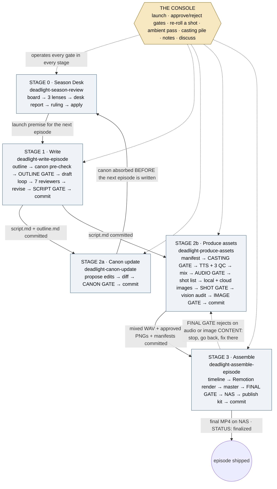
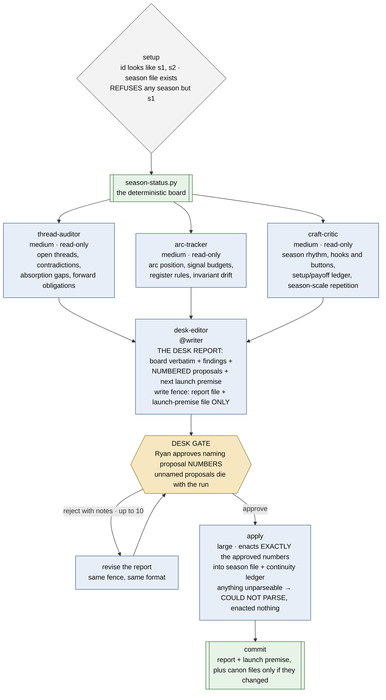
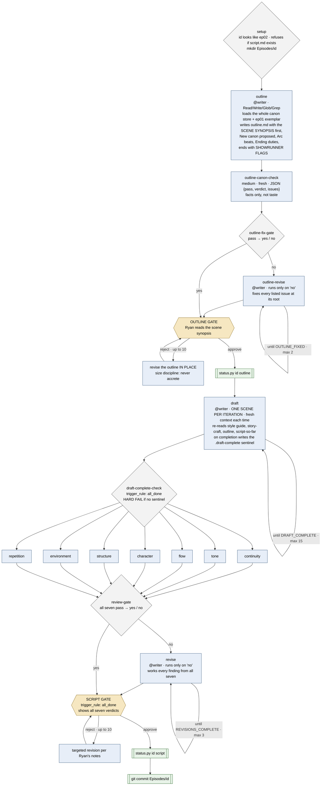
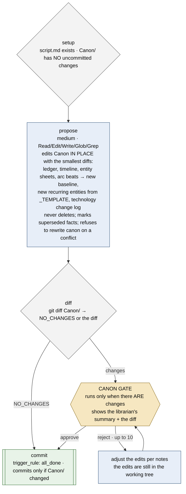
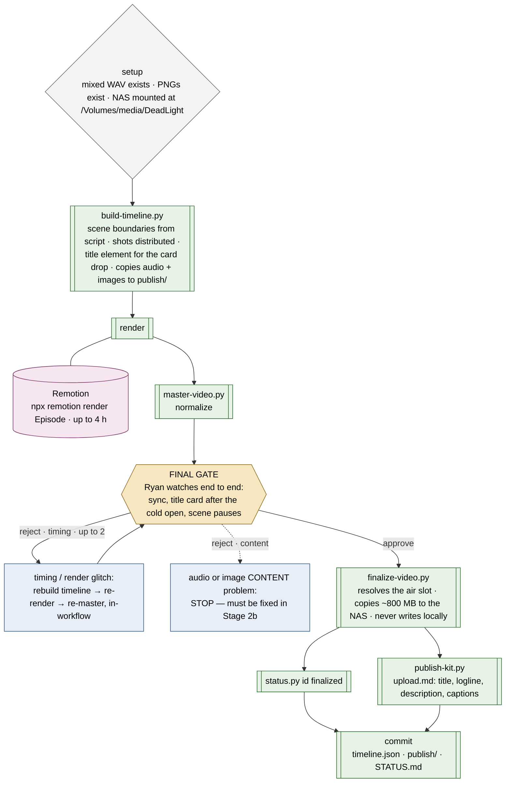
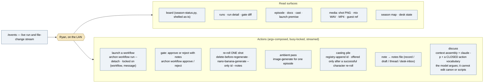

# Dead Light — The Pipeline, Step by Step

**Date:** 2026-09-25 · **Status:** REFERENCE — mapped from the files as they exist, not from memory
**Purpose:** The complete process the console drives, from a season-desk premise to a finalized episode on the NAS and a canon store that has absorbed it. Every step, every gate, every automated loop, every human loop, and every cross-stage dependency. Written as the input to a modular rewrite of the console.
**Sources read:** the five workflow definitions in `.archon/workflows/`, the scripts they call in `.archon/scripts/`, `console/server/index.ts`'s route table, and `console/README.md`. Line references point at those files.

---

## 0 · How to read this document

**The pipeline is five Archon workflows plus a console that operates them.** The workflows are the process. The console never runs a step itself; it launches workflows, answers their gates, and composes a small set of scripted actions (a shot re-roll, a note) as argv arrays.

**Every step in this document is one of five kinds.** The kind is the thing a rewrite cares about, because it says what the step's replacement would have to be.

| Kind | Symbol in the diagrams | What it is | What swapping it means |
|---|---|---|---|
| **Human gate** | hexagon `{{ }}` | Archon pauses; Ryan approves or rejects with notes. A rejection runs a fix agent and re-presents the gate. | The gate stays; only its presentation changes. |
| **LLM agent** | rectangle `[ ]` | A prompted model call with a tool allowlist and, usually, a JSON output schema. | Replace the prompt, the model, or the schema; the step's inputs and outputs are the contract. |
| **Deterministic script** | double rectangle `[[ ]]` | A Python script under `.archon/scripts/`, run by a bash node. Idempotent by convention: existing outputs are never regenerated. | Replace the script; the files it reads and writes are the contract. |
| **External engine** | cylinder `[( )]` | A model or renderer outside the repo: Qwen3-TTS, Z-Image, Gemini (Nano Banana), Remotion. | The seam this document exists to expose. |
| **Bash guard** | diamond `{ }` | A shell check that computes yes/no from prior outputs, or refuses to proceed. | Logic only; no model. |

**Loops are marked on their back-edges** with the sentinel they wait for and their iteration cap. Two caps recur everywhere and mean different things: **automated loops are capped small** (2, 3, 15) because a runaway agent costs money; **human-rejection loops are capped at 10** only because 10 is Archon's schema ceiling for `max_attempts` — Ryan ruled on 2026-08-28 that showrunner rejections are unlimited in intent.

**Milestones.** `status.py` stamps one line per milestone into `Episodes/<id>/STATUS.md`. The declared vocabulary is `beats, outline, script, canon, casting, audio, images, assembled, finalized` (`status.py:11`). The workflows actually stamp `outline, script, casting, audio, images, finalized`. `beats` is hand-stamped when a `locked-beats.md` exists. **`canon` and `assembled` are declared and never stamped by any workflow** — see §9.

---

## 1 · The whole pipeline at one altitude

**The ordering rules that are not visible in any single workflow file:**

1. **Stage 2a and Stage 2b run in parallel**, both reading the committed script. Neither waits for the other.
2. **Stage 2a must finish before the next episode's Stage 1 starts.** The next outline is written against the canon store, and an unabsorbed episode means the reviewers measure the new script against stale character sheets (`deadlight-canon-update.yaml`, description block).
3. **Stage 0's ritual slot is after Stage 2a and before the next Stage 1** (`deadlight-season-review.yaml`, description block). It is optional; it can be convened at any time.
4. **Stage 3's final gate can send an episode back to Stage 2b, but not automatically.** The rejection handler distinguishes a timing or render glitch (fixed in-workflow, capped at 2) from an audio or image content problem, and on content it stops and reports that the fix belongs in Stage 2b (`deadlight-assemble-episode.yaml:63-86`).
5. **Two stages write to the canon store besides Stage 2a.** Stage 2b's shot-gate rejection handler may edit `Canon/refs.json` when a rejection describes a systemic identity problem, and Stage 2b's commit adds `Canon/characters/**` stills and `Canon/refs.json` via `registry-append.py`. A rewrite that wants one canon-writing seam has to move these.

---

## 2 · Stage 0 — The Season Desk (`deadlight-season-review`)

**Input:** a season id (`s1`). **Output:** `Canon/season-desk-report.md`, an `Episodes/<id>/launch-premise.md` for the next unstarted episode, and (only for approved proposal numbers) edits to the season file and the continuity ledger.

**Step table.**

| # | Step | Kind | Reads | Writes | Cap |
|---|---|---|---|---|---|
| 0.1 | `setup` | guard | argument | — | refuses `s2`+ (`deadlight-season-review.yaml:31-33`) |
| 0.2 | `season-status` | script | `Canon/season-N.md`, `finalize-video.py`'s map, `Episodes/*/STATUS.md`, `Production/*/images/prompts.json`, the NAS | stdout board | — |
| 0.3 | `thread-auditor` | agent (medium) | continuity ledger, every produced script, the season file | findings text | — |
| 0.4 | `arc-tracker` | agent (medium) | every character bible, every produced script, the season file | findings text | — |
| 0.5 | `craft-critic` | agent (medium) | story-craft, episode-formula, series-arc, the season file, every produced script | findings text | — |
| 0.6 | `desk-editor` | agent (@writer) | the board + three findings + the season file | `Canon/season-desk-report.md`, `Episodes/<id>/launch-premise.md` | — |
| 0.7 | `desk-gate` | human | the report | the ruling text | reject ×10 |
| 0.8 | `apply` | agent (large) | the ruling + the report's Proposals section | `Canon/season-N.md`, `Canon/continuity-ledger.md`, each edit marked **Ryan-ruled (season desk, date)** | — |
| 0.9 | `commit` | script | — | git | — |

**Known limit.** Every prompt, the apply node, and the commit name `Canon/season-1.md` literally. The setup guard exists precisely so the workflow cannot be convened for Season 2 until the body is parameterized.

---

## 3 · Stage 1 — Write (`deadlight-write-episode`)

**Input:** an episode id plus a premise (usually the desk's launch premise pasted whole). **Output:** `Episodes/<id>/outline.md` and `Episodes/<id>/script.md`, committed, with STATUS stamped at `outline` and `script`.

**The seven reviewers** all share one shape — `model: medium`, `context: fresh`, read-only tools, JSON `{pass, verdict, issues[]}` — and each owns exactly one concern. That uniformity is the seam: **a new reviewer (Ryan's example: a grammar checker) is one more node of this shape, added to `review-gate`'s dependency list and to `revise`'s findings block, and nothing else changes.**

| Reviewer | Rubric it reads | What it flags |
|---|---|---|
| `continuity-check` | world-overview, technology, the-mute, timeline, continuity ledger, every entity sheet in the script | Canon contradictions, characters acting against their sheet, tier violations, timeline impossibilities, invented facts that conflict |
| `tone-check` | style-guide, the ep01 cold open | Narrator winking, menace stated rather than rendered, triumphalism, voice drift, ending flourish, the retention contract (analogy ration, sentence length) |
| `flow-check` | episode-formula, style-guide "Written for the ear" | Sentence rhythm, pacing against minute allocations, transitions, attribution clarity, new-voice runway, ping-pong dialogue, elliptical questions, unrenderable content (lyrics, chants) |
| `character-check` | every character bible, world-overview crew stances, the outline's `## Arc beats` | Courage/caution drift, stance drift, role-dynamic drift, competence-domain drift, undeclared deviations |
| `structure-check` | story-craft (whole rubric), episode-formula death rules | And-then beats, missing return-and-changed, missing sequels, unplanted payoffs, the five ending duties |
| `environment-check` | technology (gravity, comms), location files | Bare faces in vacuum, sound in vacuum, cross-pressure conversation, silent airlock teleports, unsourced gravity |
| `repetition-check` | style-guide "No descriptor tics", the two previous scripts | Manner tics, repeated images, construction frequency, AI stock phrasing, word-level echoes, cross-episode signature reuse |

**Step table.**

| # | Step | Kind | Cap | Notes |
|---|---|---|---|---|
| 1.1 | `setup` | guard | — | Refuses to overwrite an existing `script.md`. |
| 1.2 | `outline` | agent (@writer) | — | Must place the scene synopsis first; must declare deaths, arc beats, new canon, and ending duties. |
| 1.3 | `outline-canon-check` | agent (medium, fresh, JSON) | — | Reads `Canon/season-1.md` for a RULED slate entry (`deadlight-write-episode.yaml:168`) — Season 1 literal. |
| 1.4 | `outline-fix-gate` | guard | — | |
| 1.5 | `outline-revise` | agent loop | until `OUTLINE_FIXED`, max 2 | Runs only when 1.4 says no. |
| 1.6 | `outline-gate` | human | reject ×10 | Rejection handler enforces size discipline (ep09's outline grew 55% across three rounds). |
| 1.7 | `stamp-outline` | script | — | |
| 1.8 | `draft` | agent loop | until `DRAFT_COMPLETE`, max 15 | One scene per iteration, fresh context per iteration (ruled 2026-08-28 after ep09). Writes `.draft-complete` sentinel before signalling (ruled 2026-09-06 after ep10). |
| 1.9 | `draft-complete-check` | guard, `all_done` | — | Hard-fails if the sentinel is absent. |
| 1.10 | seven reviewers | agents (medium, fresh, JSON) | — | Parallel. |
| 1.11 | `review-gate` | guard | — | |
| 1.12 | `revise` | agent loop | until `REVISIONS_COMPLETE`, max 3 | Runs only when 1.11 says no. |
| 1.13 | `script-gate` | human, `all_done` | reject ×10 | |
| 1.14 | `stamp-script` | script | — | |
| 1.15 | `commit` | script | — | Commit message carries all seven verdicts. |

**Known gap, documented in the file itself** (`deadlight-write-episode.yaml:388-397`): `script-gate` needs `trigger_rule: all_done` because `revise` is legitimately skipped when nothing failed, and Archon cannot distinguish a dependency that was *skipped* from one that *failed*. So a failing `draft-complete-check` produces a loud logged error but cannot itself stop the gate from opening. Closing that is a workflow-engine change.

---

## 4 · Stage 2a — Canon update (`deadlight-canon-update`)

**Input:** an episode id whose script is committed. **Output:** edits to the canon store, committed, or a recorded no-op.

**Step table.**

| # | Step | Kind | Cap | Notes |
|---|---|---|---|---|
| 2a.1 | `setup` | guard | — | Refuses if `Canon/` is dirty, so the gate diff is only this episode's. |
| 2a.2 | `propose` | agent (medium) | — | The one licensed canon-writing agent in the pipeline. Also absorbs declared arc beats into the character sheet so the next episode's character reviewer measures against the new baseline. |
| 2a.3 | `diff` | guard | — | |
| 2a.4 | `canon-gate` | human | reject ×10 | Skipped entirely on `NO_CHANGES`. |
| 2a.5 | `commit` | script, `all_done` | — | No `status.py canon` stamp exists, although the milestone is declared. |

---

## 5 · Stage 2b — Produce assets (`deadlight-produce-assets`)

**Input:** an episode id whose script is committed. **Output:** `Production/<id>/audio/DeadLight SxxEyy.wav`, `Production/<id>/images/*.png`, and the manifests `tts-script.json`, `images/prompts.json`, `images/IMAGE-SHEET.md`, committed. Audio and image files themselves are gitignored and regenerable.

**The description block in the file is stale on one point:** it says imagery runs "in parallel with" audio. Since 2026-08-31 (`deadlight-produce-assets.yaml:322-334`) the image branch waits for the **audio gate**, so that image money is never spent before Ryan has heard a line. The diagram below shows the current dependency, not the description.

```mermaid
flowchart TD
    classDef human fill:#f6e7c1,stroke:#8a6d1f,color:#000
    classDef agent fill:#e7eef8,stroke:#33557a,color:#000
    classDef script fill:#e8f3e8,stroke:#2f6b2f,color:#000
    classDef guard fill:#f3f3f3,stroke:#666,color:#000
    classDef engine fill:#f5e6f0,stroke:#7a3366,color:#000

    A0{"setup<br/>script.md exists · mkdir Production/id/audio, images"}:::guard
    A1["tts-script<br/>large · Read/Write/Glob/Grep/Bash<br/>prose → tts-script.json:<br/>cast copied verbatim from refs.json · guests designed ·<br/>segmentation · delivery direction on 10–25% of lines ·<br/>pronunciation respellings · [BEAT]/[PAUSE n] honoured · gaps"]:::agent
    A2[["validate-manifest.py<br/>shape, every word once, no leaked marks"]]:::script
    A3{{"CASTING GATE<br/>cast, guests, new heteronyms"}}:::human
    A3R["redo the manifest per notes"]:::agent
    A4[["status.py id casting"]]:::script

    subgraph AUDIO ["Audio branch"]
        T1[["tts-generate.py"]]:::script
        TE[("Qwen3-TTS via mlx-audio<br/>clone from locked ref WAV + transcript + instruct")]:::engine
        T2[["truncation-qc.py<br/>re-rolls cut-off takes · ≤2 rounds"]]:::script
        T3[["pace-qc.py<br/>re-renders WPM outliers · ≤3 rounds"]]:::script
        T4[["breath-qc.py<br/>lengthens pauses inside runs over 8 s"]]:::script
        T5[["audio-mix.py<br/>trim → designed gaps → per-speaker loudness →<br/>room-tone bed (HUM_DB) → title-card drop → −14 LUFS"]]:::script
        T1 --- TE
        T1 --> T2 --> T3 --> T4 --> T5
    end

    AG{{"AUDIO GATE<br/>Ryan listens to the mix"}}:::human
    AGR["audio-fix operator<br/>edit tts-script.json · delete ONLY affected segment WAVs ·<br/>re-run tts-generate → 3 QC → mix (idempotent)"]:::agent
    AS[["status.py id audio"]]:::script

    subgraph IMAGE ["Image branch — waits for AUDIO GATE"]
        V1["visual-direction<br/>medium · fresh<br/>writes images/prompts.json:<br/>ambient shots (local prompt, seed) ·<br/>character shots (refs + Nano-Banana brief)<br/>pre-flight guard rejects the WHOLE run on populator words"]:::agent
        I1[["image-generate.py<br/>ambient shots only · idempotent"]]:::script
        IE[("Z-Image, local GPU")]:::engine
        N1[["nano-banana-generate.py<br/>character shots · conditions on ref sheet + 2 newest approved stills ·<br/>vision-audits every frame · retries ≤3 with audit notes ·<br/>idempotent · NANO_OK or NANO_PARTIAL"]]:::script
        NE[("Gemini / Nano Banana Pro, cloud")]:::engine
        N2[["image-sheet.py<br/>refresh IMAGE-SHEET.md"]]:::script
        NG{{"SHOT GATE (nano-banana-gate)<br/>Ryan reviews the character shots"}}:::human
        NGR["visual director re-rolls ONLY the named shot ids<br/>with Ryan's words as corrective feedback ·<br/>fixes Canon/refs.json identity if the note is systemic"]:::agent
        IA["image-audit<br/>medium · loop · LOOKS at every PNG<br/>exposure · species · interior · nautical · negation backfire ·<br/>generation defects · THE HARD LINE (no cast in ambient) · watermark<br/>fixes ambient (rewrite prompt, bump seed, delete, regen) · notes character"]:::agent
        IG{{"IMAGE GATE<br/>Ryan views the pile + auditor summary"}}:::human
        IGR["image-fix operator<br/>ambient: prompt/seed, delete, regen · character: re-brief only"]:::agent
        IS[["stamp-images:<br/>registry-append.py (approved character stills → Canon/characters) ·<br/>image-sheet.py · status.py id images"]]:::script
        V1 --> I1
        I1 --- IE
        V1 --> N1
        N1 --- NE
        N1 --> N2
        I1 --> NG
        N2 --> NG
        NG -->|"reject · up to 10"| NGR --> NG
        NG -->|"approve"| IA
        IA -->|"until IMAGES_CLEAN · max 3"| IA
        IA --> IG
        IG -->|"reject · up to 5"| IGR --> IG
        IG -->|"approve"| IS
    end

    CM[["commit<br/>tts-script.json · prompts.json · IMAGE-SHEET.md ·<br/>Canon/characters · Canon/refs.json"]]:::script

    A0 --> A1 --> A2 --> A3
    A3 -->|"reject · up to 10"| A3R --> A3
    A3 -->|"approve"| A4
    A3 -->|"approve"| T1
    T5 --> AG
    AG -->|"reject · up to 5"| AGR --> AG
    AG -->|"approve"| AS
    AG -->|"approve"| V1
    T5 -.->|"image-generate also depends on audio-mix"| I1
    AS --> CM
    IS --> CM
```

**Step table.**

| # | Step | Kind | Engine / script | Cap | Notes |
|---|---|---|---|---|---|
| 2b.1 | `setup` | guard | — | — | |
| 2b.2 | `tts-script` | agent (large) | — | — | The language stage. Reads `Production/voice-refs/refs.json` (locked cast) and `Canon/voice-registry.md` (rules, pronunciation map, mixing conventions). Writes the manifest. |
| 2b.3 | `validate-manifest` | script | `validate-manifest.py` | — | Fails the build on a leaked `[BEAT]` mark or an out-of-range pause. |
| 2b.4 | `casting-gate` | human | — | reject ×10 | |
| 2b.5 | `stamp-casting` | script | `status.py` | — | Parallel with 2b.6. |
| 2b.6 | `tts-generate` | script + engine | `tts-generate.py` → Qwen3-TTS (mlx-audio) | — | Per-segment synthesis, pinned seeds; idempotent. Timeout 3 h. |
| 2b.7 | `truncation-qc` | script + engine | `truncation-qc.py` | ≤2 re-roll rounds | Runs first so chopped takes do not skew pace. |
| 2b.8 | `pace-qc` | script + engine | `pace-qc.py` | ≤3 re-render rounds | |
| 2b.9 | `breath-qc` | script | `breath-qc.py` | — | |
| 2b.10 | `audio-mix` | script | `audio-mix.py` | — | Names the file from a literal `AIR` dict (Season 1 only — see §9). |
| 2b.11 | `audio-gate` | human | — | reject ×5 | |
| 2b.12 | `stamp-audio` | script | `status.py` | — | |
| 2b.13 | `visual-direction` | agent (medium, fresh) | — | — | Waits for the audio gate. Writes `prompts.json`. |
| 2b.14 | `image-generate` | script + engine | `image-generate.py` → Z-Image (local) | — | Ambient shots only. Depends on both `visual-direction` and `audio-mix`. |
| 2b.15 | `nano-banana-generate` | script + engine | `nano-banana-generate.py` → Gemini (cloud) | ≤3 audit retries per shot | Character shots. `NANO_PARTIAL` is reportable, not a failure. Timeout 3 h. |
| 2b.16 | `nano-banana-gate` | human | — | reject ×10 | Rejection handler re-rolls only named ids, and **may write `Canon/refs.json`**. |
| 2b.17 | `image-audit` | agent loop (medium) | — | until `IMAGES_CLEAN`, max 3 | The real image gate; `image-qc.py` (histograms) is explicitly advisory only. |
| 2b.18 | `image-gate` | human | — | reject ×5 | |
| 2b.19 | `stamp-images` | script | `registry-append.py`, `image-sheet.py`, `status.py` | — | **Writes `Canon/characters/**`.** |
| 2b.20 | `commit` | script | — | — | Commits manifests and the canon stills. |

**The seams Ryan named, located.** *A non-local TTS engine* replaces the engine behind step 2b.6, and only that: `tts-generate.py`'s contract is "read `tts-script.json`, write one WAV per segment plus `audio/manifest.json`." Everything downstream — the three QC passes, the mix, the gate — reads segment WAVs and knows nothing about Qwen3. The manifest's `cast` block (ref WAV, transcript, direction, fx, speed) is the part of the contract that is Qwen3-shaped and would need a per-engine adapter.

---

## 6 · Stage 3 — Assemble (`deadlight-assemble-episode`)

**Input:** an episode id with an approved mix, approved PNGs, and the NAS mounted. **Output:** `Production/<id>/video/episode.mp4` (mastered), the final MP4 on the NAS, `Production/<id>/publish/` (upload kit), STATUS `finalized`, committed.

**Step table.**

| # | Step | Kind | Notes |
|---|---|---|---|
| 3.1 | `setup` | guard | The NAS check is here so a finalize cannot fail after a four-hour render. |
| 3.2 | `build-timeline` | script | Reads a literal `_AIR` dict to find the mix filename (Season 1 only — §9). |
| 3.3 | `render` | script + engine | Remotion. |
| 3.4 | `master` | script | |
| 3.5 | `final-gate` | human | reject ×2 for timing; content rejections stop the run. |
| 3.6 | `finalize` | script | `finalize-video.py` resolves the air slot from `SEASON_MAP` or by scanning every `Canon/season-N.md` for a RULED row. |
| 3.7 | `stamp-finalized` | script | No `assembled` stamp exists, although the milestone is declared. |
| 3.8 | `publish-kit` | script | Reads a literal `AIR` dict and a literal `LOGLINE` dict (§9). |
| 3.9 | `commit` | script | |

---

## 7 · The console's own steps

The console adds no pipeline steps. It adds **operations on the pipeline**, each composed as an argv array to an existing script or `archon` call, never a shell string, and each busy-locked so a double-tap cannot start two runs (`console/server/index.ts:847-1043`).

**Fences the current console holds, all of which a rewrite should keep:**

- It never edits canon or scripts directly; every change goes through a workflow gate or a scripted action.
- Every child process is an argv array; no string is ever passed to a shell unvalidated. Episode ids and season ids are regex-validated before they reach argv (`discuss.ts:23`, `seasons.ts:14`).
- Seasons are discovered from the filesystem (`Canon/season-N.md` exists ⇔ the season exists); there is no separate registry to drift.
- The board is `season-status.py`'s output shelled as-is: one derivation, never re-implemented.

**Operational law, not encoded anywhere in the console** (from the ep10 post-mortem): launch, approve, and reject must be run **detached** — `( nohup archon workflow <verb> <args> > "$LOG" 2>&1 < /dev/null & )` — because a console approve was not reliably safe and cost half a day. A rewrite must make detachment the only path.

---

## 8 · The module inventory — the seams a rewrite would cut along

Grouping every step above by the contract it honours produces nine modules. Each row names the module's inputs, its outputs, and what is inside it that could be swapped without touching its neighbours.

| Module | Steps | Input contract | Output contract | Swappable inside |
|---|---|---|---|---|
| **Season desk** | 0.2–0.8 | `Canon/season-N.md`, continuity ledger, all scripts, all bibles | desk report, launch premise, numbered rulings applied | The three lenses (add a fourth), the editor's prompt, the ruling parser |
| **Story: outline** | 1.2–1.6 | premise + the canon store | `outline.md` in the house format | The architect prompt, the canon pre-check, the gate presentation |
| **Story: draft** | 1.8–1.9 | `outline.md` + style-guide + story-craft | `script.md` + completion sentinel | The prose prompt, the per-scene loop, the model |
| **Story: review panel** | 1.10–1.13 | `script.md` + `outline.md` + canon | seven JSON verdicts → one all-pass bit | **Any reviewer; add a reviewer** — same shape, add to two dependency lists |
| **Canon store** | 2a.2–2a.5 | approved `script.md` + `outline.md` threads | minimal in-place diffs, gated | The librarian prompt; the diff presenter |
| **Voice** | 2b.2–2b.12 | `script.md` + `voice-refs/refs.json` + `voice-registry.md` | `tts-script.json` → segment WAVs → mixed WAV at −14 LUFS | **The TTS engine** (behind `tts-generate.py`); each QC pass; the mix conventions |
| **Vision** | 2b.13–2b.19 | `script.md` + `Canon/refs.json` + `visual-style.md` | `prompts.json` → PNGs → `IMAGE-SHEET.md` + registry stills | The local generator, the cloud generator, the vision auditor, the sheet builder |
| **Assembly** | 3.2–3.8 | mixed WAV + PNGs + `script.md` | timeline → MP4 → mastered MP4 → NAS copy → publish kit | The renderer (Remotion), the master pass, the publish-kit format |
| **Status & registry** | every `status.py` call, `registry-append.py`, `image-sheet.py`, `season-status.py` | STATUS.md lines, canon stills, prompts.json | the board | The milestone vocabulary; the board derivation |

**Cross-cutting, and therefore not a module:** the human gate. Nine of them, one shape — a message, a `capture_response`, an `on_reject` prompt, a `max_attempts`. A rewrite should have exactly one gate implementation.

**Worked example — Ryan's grammar checker.** It is a Story: review panel member. It is one new node in Stage 1 with the panel's shape (`model: medium`, `context: fresh`, read-only tools, JSON `{pass, verdict, issues[]}`), a prompt that reads `script.md` and the style guide, one more name in `review-gate`'s `depends_on` and its all-pass loop, and one more line in `revise`'s findings block. Nothing else in the pipeline learns it exists.

**Worked example — a hosted TTS engine.** It is the engine behind Voice step 2b.6. `tts-generate.py`'s contract is "for each segment in `tts-script.json` with no existing WAV, produce `audio/segments/<i>.wav`; then write `audio/manifest.json`." A new engine is a new implementation of that contract. The manifest's `cast` block is Qwen3-shaped — reference WAV, transcript, instruct string, fx chain, speed — so a hosted engine needs an adapter from that block to whatever it accepts (a voice id and a style string, typically). The three QC passes, the mix, and the audio gate do not change.

---

## 9 · What a rewrite has to fix, because the current pipeline cannot do Season 2

These are all verified against the files, not inferred.

| # | Problem | Where | Effect |
|---|---|---|---|
| 1 | **Every season-table parser requires `**RULED**`.** | `season-status.py:34`, `console/server/repo.ts:44`, `finalize-video.py` `season_slot()` | A DRAFT row is invisible to the board, the console, and finalize. |
| 2 | **Production ids are a flat `epNN` namespace shared across seasons.** | four workflow `setup` guards (`^ep[0-9]{2,}$`), `discuss.ts:23`, `repo.ts:47`, `gates.ts:107`, `sse.ts:107`, `season-status.py:53`'s default `ep{air:02d}` | Season 2 air slot 1 resolves to `ep01`, which is Season 1 Episode 1's directory. The board currently reports S2E1 as finished with 55 images because it is reading S1E1. |
| 3 | **The console's air-map parser hardcodes season 1.** | `console/server/repo.ts:72` (`if (season === 1)`) | Every non-season-1 `SEASON_MAP` entry is discarded. |
| 4 | **Three literal `AIR` dicts and one `LOGLINE` dict, Season 1 only.** | `audio-mix.py:13`, `build-timeline.py:106`, `publish-kit.py:23-25` | An unmapped id writes `episode.wav`; the timeline then fails to find `DeadLight S02E01.wav`; the publish kit has no logline. |
| 5 | **`deadlight-season-review` refuses any season but s1** by design, because its body names `Canon/season-1.md` literally in every prompt. | `deadlight-season-review.yaml:31-33` | The desk cannot be convened for Season 2. |
| 6 | **The outline canon pre-check reads `Canon/season-1.md`** for the RULED slate entry. | `deadlight-write-episode.yaml:168` | A Season 2 outline is audited against the wrong season file. |
| 7 | **Two declared milestones are never stamped**: `canon`, `assembled`. | `status.py:11` vs. the workflows | The board cannot show canon-absorbed or assembled-not-finalized states. |
| 8 | **Archon cannot distinguish a skipped dependency from a failed one**, so a guard cannot close a gate. | `deadlight-write-episode.yaml:388-397` | A partial draft can still reach the script gate, loudly flagged but not blocked. |
| 9 | **`prior_success` never invalidates when inputs change.** | Archon engine behaviour (ops memory) | A gate can pass on a stale artifact; the operator must check downstream mtimes by hand. |
| 10 | **Canon is written from three places**, not one. | 2a.2 (licensed), 2b.16's rejection handler (`refs.json`), 2b.19 (`Canon/characters/**`) | A rewrite that wants one canon seam must route the latter two through it. |

**The single design decision that dissolves items 2, 3, and 4 together** (proposed 2026-09-25, not yet ruled): let production ids take the shape `sXXeYY` from Season 2 onward, keep `epNN` for Season 1's ten shipped episodes as historical ids, and resolve season and episode by parsing the id, falling back to `SEASON_MAP` only for legacy ids. Then `SEASON_MAP` and the three `AIR` dicts become a single legacy lookup, and every future episode is self-describing.

---

## 10 · What this document does not cover

- The **content** of any prompt beyond what defines its inputs, outputs, and rubric. The prompts are the craft; they live in the YAML and change often.
- The **internals** of `tts-generate.py`, `nano-banana-generate.py`, `build-timeline.py`, and `audio-mix.py` beyond their contracts. Each has a docstring.
- The console's **client** (`console/src`). This map is of the process and the server's action surface, which is what a rewrite re-implements first.
